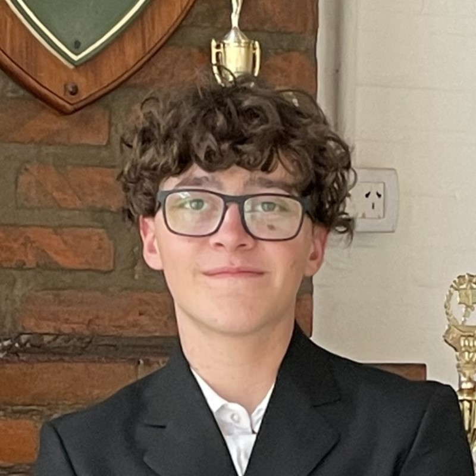

# Martín Stanicio

## Sobre mí

Soy Martín, estoy estudiando **ingeniería en sistemas de información**. Me gusta la programación, y hago desarrollo web freelance.

Estoy cursando las siguientes materias:

- Análisis Matemático 2
- Física 2
- Sintaxis y Semántica de los Lenguajes
- Paradigmas de Programación
- Análisis de Sistemas de Información
- Probabilidades y Estadisticas
- Comunicación de Datos

## Lenguajes más utilizados

